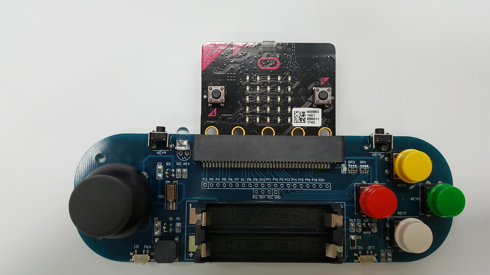
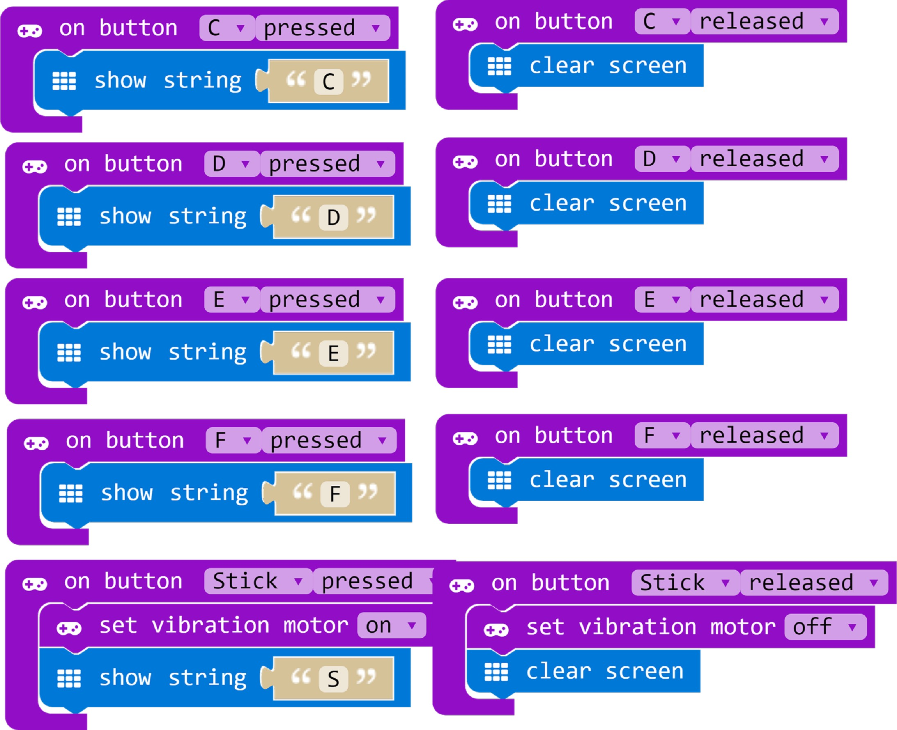
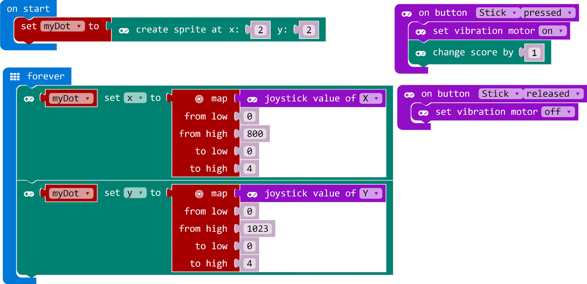

# KSB045

這是專為micro:bit提供的KSB045搖桿積木\
This is the GamePad blocks for KSB045

## Author
Liou Zheng-Ji\
劉正吉\
[my page, https://sites.google.com/jes.mlc.edu.tw/ljj/](https://sites.google.com/jes.mlc.edu.tw/ljj/)

## KSB045
KSB045 is a gamepad extension board for microbit manufactured in Taiwan.\
[KSB045, link here](http://www.buyic.com.tw/product_info.php?products_id=6747&Twesid=9pummf26rphq5rimfp8e0gatf2)


## Sample1


## Sample2


## License

* MIT

## Supported targets

* for PXT/microbit
(The metadata above is needed for package search.)

```package
KSB045=github:lioujj/pxt-KSB045
```
